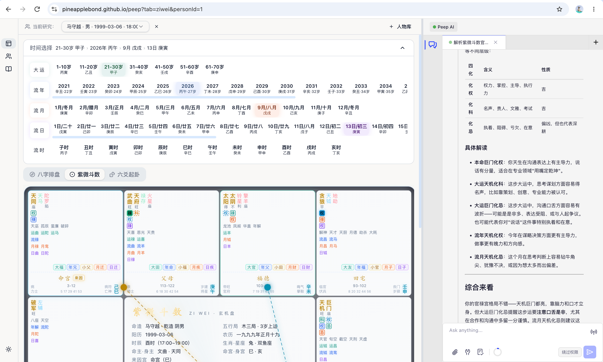

<div align="center">

# 🔮 Peep

### *洞察命理 · 记录人生*

**人物档案 · 文档管理 · 八字排盘 · 紫微斗数 · 六爻起卦 —— 一站式国学命理工作台**

*内置 AI 助手，由 `<rtc-agent>` 驱动，对话即操作*

[在线体验](https://pineapplebond.github.io/peep/) · [技术架构](#-rtc-agent-集成) · [本地开发](#-本地开发)

<br>



</div>

---

<br>

## ✨ 为什么做 Peep？

命理学习者面临一个共同困境：**排盘工具散乱、案例记录无序、分析过程难以回溯。**

Peep 将人物档案、文档管理与三大命理体系深度整合，并内嵌 AI 助手 —— 让每一次排盘都有据可查，每一次分析都有迹可循。

<br>

## 📦 核心功能

### 🗂️ 人物档案

> 一切命理分析的起点。

- 支持公历 / 农历出生日期，自动转换
- 性别、出生时辰、备注信息一站式管理
- 软删除 + 垃圾篓恢复，不怕误操作
- 人物关联文档自动统计

### 📝 文档管理

> 回忆录 · 日记 · 笔记 —— 三种文档，统一管理。

| 类型 | 用途 | 场景 |
|:---:|------|------|
| 📖 回忆录 | 记录过往经历与重要事件 | 为命理分析提供背景素材 |
| 📔 日记 | 每日记录与生活随笔 | 追踪日常运势感受 |
| 📒 笔记 | 学习笔记与心得总结 | 积累命理知识体系 |

- **文件夹树** —— 多级嵌套，构建你的知识体系
- **标签系统** —— 灵活分类，一个文档可关联多个标签
- **人物关联** —— 按人物过滤文档，快速定位相关记录
- **Markdown 编辑器** —— 支持 GFM 语法、代码高亮

### 🔮 三大命理体系

统一工作台，一键切换，共享人物数据：

<div align="center">

| 八字排盘 | 紫微斗数 | 六爻起卦 |
|:---:|:---:|:---:|
| 四柱推命，天干地支 | 十二宫位，星曜布局 | 掷卦成象，随机应变 |
| 大运 · 流年 · 流月 · 流日 · 流时 | 命宫 · 身宫 · 十二宫 | 老阴 · 少阳 · 少阴 · 老阳 |
| 基于 `iztro` 引擎 | 基于 `iztro` 引擎 | 自研摇卦 + 时间楼层 |

</div>

- 选人物 → 自动排盘，无需重复输入
- URL 参数驱动：`/?tab=bazi&personId=1` 直达指定视图
- 排盘结果可截图、可关联笔记

<br>

## 🤖 rtc-agent 集成

> **这是 Peep 的灵魂。** AI 不只是聊天窗口 —— 它能读取你的数据、调用你的函数、操作你的界面。

### 架构一览

```
┌─────────────────────────────────────────────────────────┐
│  Peep (React App)                                       │
│                                                         │
│  ┌──────────┐  ┌──────────────┐  ┌───────────────────┐ │
│  │ Sidebar  │  │   Main Area  │  │   Right Panel     │ │
│  │  🧭  🧑  📝│  │  排盘 / 文档  │  │  ┌─────────────┐ │ │
│  │          │  │              │  │  │ <rtc-agent> │ │ │
│  │          │  │              │  │  │   Web       │ │ │
│  │          │  │              │  │  │   Component │ │ │
│  │          │  │              │  │  └─────────────┘ │ │
│  └──────────┘  └──────────────┘  └───────────────────┘ │
│                       ▲                    │            │
│                       │     window.peep    │            │
│                       └────────────────────┘            │
│                         (AI 调用业务 API)                │
└─────────────────────────────────────────────────────────┘
```

### 集成方式

**`<rtc-agent>` 是一个 Web Component**，通过 CDN 加载，嵌入到 React 应用的右侧面板：

```tsx
// MainLayout.tsx — AI 面板作为应用的一部分
<aside style={{ width: `${rightPanelWidth}px` }}>
  <rtc-agent
    ref={agentRef}
    app-label="Peep AI"
    scenarios-url="/peep/rtc-agent/scenarios/"
    redirect-uri="/peep/auth/callback.html"
    server-url="https://rtc-agent.cherish.chat"
  />
</aside>
```

**关键设计决策：**

| 决策 | 原因 |
|------|------|
| Web Component 而非 npm 包 | 宿主框架无关，升级不受 React 版本约束 |
| 嵌入式最大化模式 | 禁用拖拽/缩放/最小化，AI 面板成为应用原生部分 |
| 可拖拽分隔线 | 用户可自由调整面板宽度（280px ~ 800px） |
| 测试时移除元素 | `VITE_RTC_AGENT_DISABLED=true` 彻底避免浮层拦截指针事件 |

### 声明式配置

AI 的能力通过 **Zod Schema 驱动** 的函数定义暴露给 `<rtc-agent>`：

```typescript
// rtc-agent-config.ts
export async function createRtcAgentConfig(): Promise<RtcAgentConfig> {
  return {
    name: 'Peep',
    persona,                    // 从 AGENT.md 加载的 AI 人格
    groups: [
      { name: 'person',   functions: [/* create, get, list */] },
      { name: 'document', functions: [/* create, list, view */] },
      { name: 'folder',   functions: [/* create, list */] },
      { name: 'tag',      functions: [/* list */] },
      { name: 'bazi',     functions: [/* chart */] },
      { name: 'ziwei',    functions: [/* chart */] },
      { name: 'liuyao',   functions: [/* create, get, list */] },
    ],
  };
}
```

每个函数都有 **Zod Schema 校验** + **自然语言描述** + **示例值**，组件自动生成 OpenAPI 文档供 AI 理解：

```typescript
const personCreateSchema = z.object({
  name: z.string().min(1).describe('人物姓名，用于显示和搜索。'),
  birthDate: z.string().regex(/^\d{4}-\d{2}-\d{2}$/)
    .describe('出生日期，ISO 8601 格式（YYYY-MM-DD）。'),
  gender: z.enum(['male', 'female']).describe('性别，影响大运排法。'),
  // ...
});
```

### AI 能做什么？

用户只需要用自然语言对话，AI 助手可以：

- 🧑 **"帮我创建一个叫张三的人物"** → 调用 `person.create`，自动跳转人物详情页
- 📝 **"写一篇日记，记录今天的面试"** → 调用 `document.create`，跳转编辑页
- 🔮 **"帮我排张三的八字，看看今年的流年"** → 调用 `bazi.chart`，展示排盘结果
- 🎲 **"起一卦，问最近适不适合跳槽"** → 自动摇卦 → `liuyao.create` → 展示卦象
- 📁 **"创建一个'紫微学习'文件夹"** → 调用 `folder.create`，跳转文档页

> AI 不只是回答问题 —— 它能 **操作界面**、**调用 API**、**引导流程**。

<br>

## 🛠️ 技术栈

| 层 | 技术 |
|---|------|
| 框架 | React 19 · TypeScript 6 · Vite 8 |
| 样式 | Tailwind CSS 4 · 明暗双主题 |
| 组件 | Radix UI · shadcn/ui · Lucide Icons |
| 数据 | Dexie (IndexedDB) · Zustand |
| 命理引擎 | iztro · lunar-lite · lunar-typescript |
| AI 集成 | rtc-agent (Web Component) · Zod Schema |
| 编辑器 | ByteMD (Markdown + GFM) |
| 测试 | Playwright E2E (172 tests) |
| Lint | Oxlint |
| 部署 | GitHub Pages |

<br>

## 🚀 本地开发

```bash
# 克隆仓库
git clone https://github.com/PineappleBond/peep.git
cd peep

# 安装依赖
npm install

# 启动开发服务器
npm run dev

# 运行测试
npm test
```

<br>

## 📄 License

MIT

---

<div align="center">

*用现代工具传承古老智慧* 🏮

</div>
